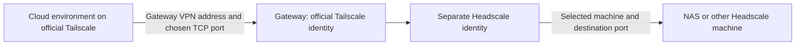

# Headscale Cloudron App

Cloudron package for [Headscale](https://headscale.net/), with persistent SQLite storage, a web UI protected by Cloudron login, public GHCR images and tested weekly upstream updates.

[](https://www.buymeacoffee.com/jbjardine)

## Install

Add this community app store URL under **App Store → Settings** in Cloudron:

```text
https://raw.githubusercontent.com/jbjardine/headscale-cloudron-app/main/CloudronVersions.json
```

Install **Headscale**, then open **Configure**. The prepared `0.29.4-2` catalog entry stays in `testing` until the publication workflow has tested and pushed its image. Run that workflow manually after merging, or wait for its weekly run. Once published, advanced direct installation from the package directory is:

```sh
cloudron install --location headscale --image ghcr.io/jbjardine/headscale-cloudron-app:v0.29.4-2
```

## Add a machine

Open **Enrollment keys**, select or create a Headscale user, then choose a registration type. Copy the complete key from the creation dialog and run its connection command on the machine. Keys created in the upstream **User View** also open this dialog.

Headscale returns the full key **only when it is created**. The key list contains metadata and a public identifier, so an old key's secret cannot be recovered. Create a replacement and expire the old key if its secret was lost.

| Registration type | Default enrollment period | Behavior |
| --- | --- | --- |
| One machine | 7 days | One registration; machine remains registered |
| Temporary cloud environments | 90 days | Reusable; offline ephemeral machines are cleaned up by Headscale |
| Several permanent machines | 90 days | Reusable; registered machines persist |

Enrollment key expiration prevents new registrations. It does not disconnect registered machines; node expiration is a separate Headscale setting. **Expire** works with the Headscale 0.29 API and does not delete machines.

The browser API supports administration while keeping the package's Headscale API token on the server. API-key mutations are blocked. UI mutations require the authenticated same-origin UI. `/web` and its API are protected by Cloudron `proxyAuth`; direct Docker installs need their own authentication reverse proxy.

## Optional Tailscale gateway

Cloud platforms that accept only `tskey-auth-…` keys cannot enroll directly in a custom Headscale server. This package can bridge selected TCP services while keeping your machines on Headscale:



The gateway is **disabled by default**. It uses the official Tailscale `tsnet` library with two separate userspace networks and persistent identities. Only configured ports have listeners; the container's web UI, administrative API and other local ports are not forwarded. No TUN device, `NET_ADMIN`, host VPN changes, subnet routes, exit node or public Funnel is used.

1. Create a dedicated Headscale user and allow it to reach the desired machines in your existing Headscale policy.
2. Open **Tailscale gateway**. Select that user and enter an **official Tailscale auth key** from your Tailscale account for a permanent gateway machine. Its Headscale registration key is generated automatically. Enable and save; you can first connect with no service rules.
3. Add TCP services by selecting registered Headscale machines. For example, gateway port `1445` can forward to your NAS's port `445`; port `2022` can forward to SSH port `22`.
4. Choose allowed official Tailscale source addresses/CIDRs, or explicitly choose all clients allowed by your Tailscale policy. An empty restricted source list allows no service connections. Tailscale grants and Headscale policy remain in effect and are never rewritten by this app.
5. Set the global connection limit, bandwidth limit and idle timeout, then save. Changes reconnect the gateway and close its current service connections.
6. Give the cloud environment its **own reusable official Tailscale auth key** through its native VPN settings. Permit the gateway IPv4 in the cloud's network policy where required, and connect to that IPv4 and the chosen service port. Managed environments may require their documented TCP CONNECT proxy; use their network instructions. Tailscale MagicDNS is not required.

For tagged cloud clients and a tagged gateway, merge an appropriate grant into your existing official Tailscale policy, and define/assign the tags in your account:

```json
{"grants":[{"src":["tag:cloud-dev"],"dst":["tag:headscale-gateway"],"ip":["tcp:1445","tcp:2022"]}]}
```

| Limit | Behavior |
| --- | --- |
| Destinations | Registered Headscale VPN addresses and explicitly selected TCP ports |
| Sources | Explicit Tailscale IP/CIDR allowlist, or all clients allowed by Tailscale policy |
| Connections | Global maximum, default 16 |
| Bandwidth | Shared across services and both directions; 0 is unlimited; at most a 16 KiB burst |
| Idle timeout | Default 900 seconds, renewed by traffic in either direction |

Original source addresses are checked at gateway entry. Destination machines see the Headscale gateway as the connection source. Application authentication and TLS remain the destination service's responsibility: use its normal credentials and hostname/certificate validation. TCP forwarding does not support UDP, broadcast discovery or direct access to every private IP.

Keys and identity state live under `/app/data/gateway` with private permissions and are included in Cloudron backups. The browser receives only a saved-key indicator, never stored secrets. Disabling the gateway closes listeners and keeps its identities for reuse. A replacement auth key does not move an already registered official identity to a different account. To deliberately replace an identity, disable the gateway, remove the corresponding machine from the coordination server and remove only its matching state directory/key through Cloudron's app terminal before reenrolling. Keep backups before such manual identity resets.

The one-hour Headscale key used internally is only for the gateway's initial registration; its registered identity survives subsequent app restarts. Official Tailscale node expiration is controlled in your Tailscale account, independently of auth-key expiration.

## Weekly updates

Every Monday at **03:17 UTC**, `Autopublish upstream updates` checks stable Headscale, Headscale UI, Tailscale SDK and Alpine releases. It can also be run manually. It rejects downgrades, verifies binary/archive SHA256 hashes and Go module checksums, updates versions/checksums and prepares the next Cloudron package version.

Before publishing, it runs API/security regression tests, local tsnet forwarding tests, a reachable-vulnerability check with the Go vulnerability database, a Docker build, real packaged key creation/expiration and SDK enrollment tests, restart persistence checks, desktop/mobile browser flows, Cloudron catalog verification and workflow lint. A failure stops publication. The **same tested image** is pushed to GHCR before the Git tag and Cloudron catalog update; a failed image push cannot advertise a missing image. Missing release artifacts can be repaired by rerunning the workflow.

The current package tracks:

- Headscale `0.29.4`
- Headscale UI `2026.03.17`
- Tailscale gateway SDK `1.102.5`
- Alpine `3.24`

Automatic checks publish package releases; Cloudron's own update/backup settings control installation on a running server. `GITHUB_TOKEN` needs repository contents and package write permissions for publication. Branch protection must allow the existing automation to publish to `main`, or publication will stop at the Git push.

## Build and test

```sh
python3 -m unittest discover -s tests -v
(cd gateway && go test -race ./...)
(cd gateway && go run golang.org/x/vuln/cmd/govulncheck@v1.8.0 ./...)
docker build -t headscale-cloudron-app:check .
python3 scripts/smoke_image.py --check-tsnet --image headscale-cloudron-app:check
npm ci --prefix tests/browser
npx --prefix tests/browser playwright install --with-deps chromium
node tests/browser/smoke.cjs headscale-cloudron-app:check
```

The gateway requires Go 1.26.6 or later; the Docker builder supplies it. Browser tests require Node 24 and Chromium. Tests use disposable local data and coordination servers and do not enroll in your real networks. In a managed cloud workspace, follow its Docker/proxy/CA instructions; the image accepts an optional BuildKit CA secret named `proxy_ca` for verified build downloads without including that CA in the final image.

HTTP is exposed on `8080`; optional embedded DERP STUN uses `3478/udp` and is disabled in the default Headscale configuration. SQLite and configuration persist under `/app/data`. Existing custom Headscale policies and configuration are preserved; the narrowly scoped legacy generated-policy migrations retain their timestamped backups.
